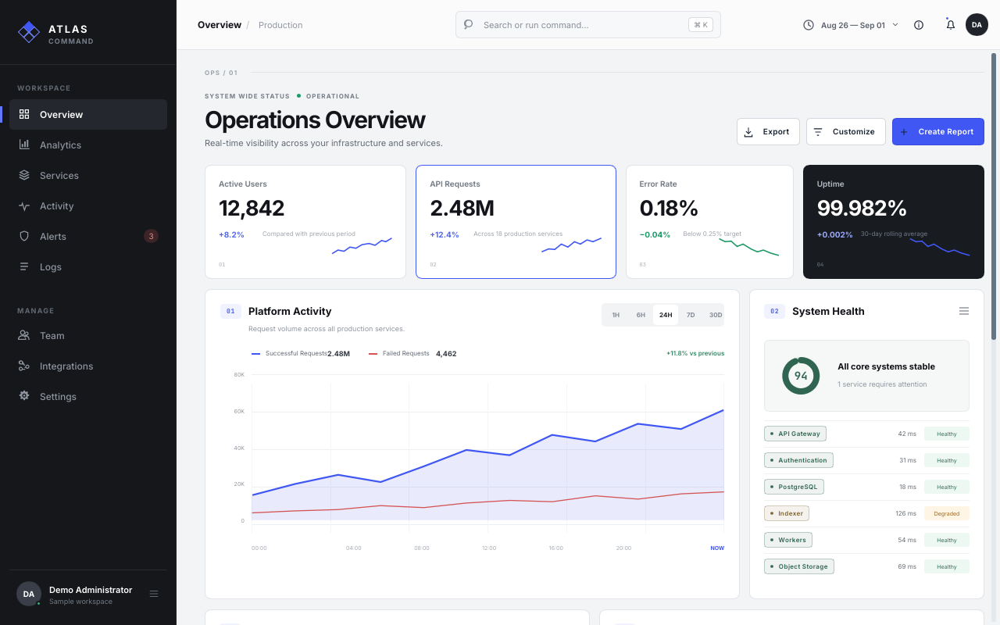
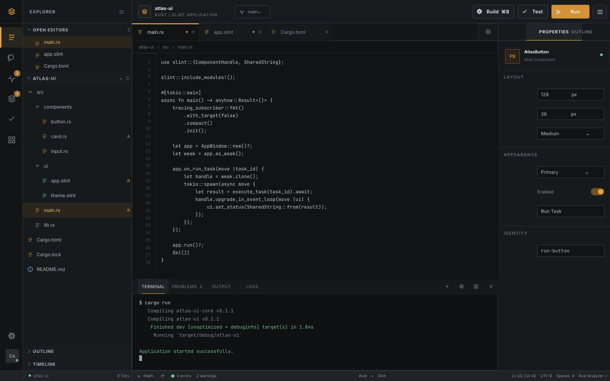
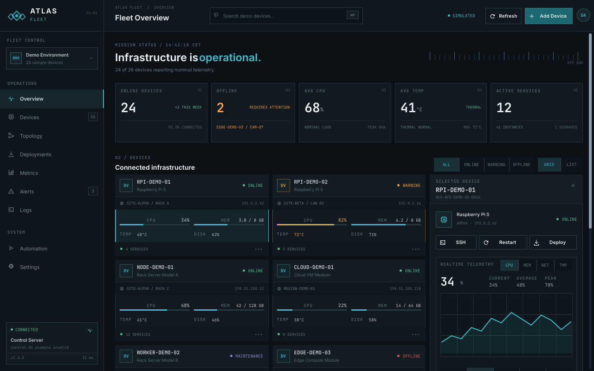
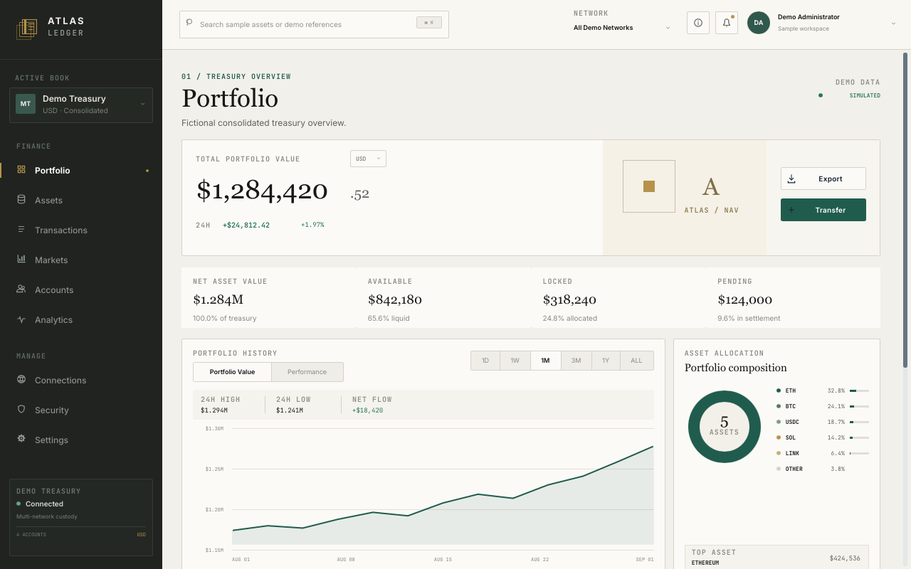

# Atlas Template Suite

[](https://github.com/0xrariux/template-atlas/actions/workflows/ci.yml)
[](https://github.com/0xrariux/Atlas-UI)

Four native desktop interface templates built with Slint and Rust:

- **Atlas Command** — operations and analytics
- **Atlas Forge** — engineering workspace
- **Atlas Fleet** — infrastructure control
- **Atlas Ledger** — institutional treasury

The templates consume the current source checkout of
[`Atlas UI`](https://github.com/0xrariux/Atlas-UI) with Slint 1.18.0. Atlas
0.2.0 is the Slint 1.18 release candidate; the published 0.1.1 crate is
the earlier Slint 1.17.1 release. The four manifests use a sibling Atlas path
for both runtime and build dependencies until a compatible package is released.

## Preview

<table>
  <tr>
    <td width="50%">
      <a href="assets/previews/command.png"></a><br>
      <strong>Atlas Command</strong> — operations, services, activity, alerts, and administration.
    </td>
    <td width="50%">
      <a href="assets/previews/forge.png"></a><br>
      <strong>Atlas Forge</strong> — a code-oriented engineering workspace with explorer and inspector surfaces.
    </td>
  </tr>
  <tr>
    <td width="50%">
      <a href="assets/previews/fleet.png"></a><br>
      <strong>Atlas Fleet</strong> — infrastructure, telemetry, deployments, and incident control.
    </td>
    <td width="50%">
      <a href="assets/previews/ledger.png"></a><br>
      <strong>Atlas Ledger</strong> — portfolio, assets, transactions, markets, and treasury settings.
    </td>
  </tr>
</table>

These are complete demonstration applications rather than components copied
into Atlas UI. They show how Atlas primitives can be composed while keeping
product identity, domain models, and navigation in the consuming application.

## Requirements

- Rust 1.92 with Cargo
- A sibling Atlas UI source checkout containing the Slint 1.18 changes
- Internet access for the first dependency download

## Clone the templates and Atlas

```bash
git clone https://github.com/0xrariux/Atlas-UI.git Atlas
git -C Atlas checkout 6e9f4cbfd42be205a0363e22ca92d3d527bf146b
git clone https://github.com/0xrariux/template-atlas.git template-atlas
cd template-atlas
```

Keep `Atlas/` and `template-atlas/` in the same parent directory. Each
application pins `slint` and `slint-build` to 1.18.0 and configures the
`@atlas-ui` Slint library path through `atlas_ui::slint_library_paths()` in its
build script. The checkout command and CI pin the same Atlas 0.2.0 candidate
revision. The published Atlas 0.1.1 source is not equivalent.

## Validate

```bash
cargo check --manifest-path slint/command/Cargo.toml --all-targets
cargo check --manifest-path slint/forge/Cargo.toml --all-targets
cargo check --manifest-path slint/fleet/Cargo.toml --all-targets
cargo check --manifest-path slint/ledger/Cargo.toml --all-targets
```

Run the complete formatting, compilation, Clippy, and test gate with:

```bash
./scripts/quality-gate.sh
```

The prerelease Slint 1.18 and local Atlas source review, including 97 rendered
states and comparison limits, is recorded in
[docs/SLINT_1_18_REVIEW.md](docs/SLINT_1_18_REVIEW.md).

## Run a template

```bash
cargo run --manifest-path slint/command/Cargo.toml --bin atlas-command
cargo run --manifest-path slint/forge/Cargo.toml --bin atlas-forge
cargo run --manifest-path slint/fleet/Cargo.toml --bin atlas-fleet
cargo run --manifest-path slint/ledger/Cargo.toml --bin atlas-ledger
```

Each template also has its own documentation:

- [`slint/command/README.md`](slint/command/README.md)
- [`slint/forge/README.md`](slint/forge/README.md)
- [`slint/fleet/README.md`](slint/fleet/README.md)
- [`slint/ledger/README.md`](slint/ledger/README.md)

Native screenshot capture and comparison helpers are available under
[`scripts/`](scripts/). Their generated images and AI-assisted working material
live under the ignored `ai/` directory.

Run `./scripts/capture-readme-previews.sh` to regenerate the four images above.
See [Preview capture](docs/PREVIEWS.md) for deterministic capture details and
guidance on when an animated GIF is useful.

## Validate a local Atlas change

With the repositories side by side, run `./scripts/quality-gate.sh` from this
repository. All four templates compile directly against the sibling Atlas
checkout, so no temporary Cargo patch is needed.

## Demo data

All identities, balances, devices, incidents, addresses, services, and events
shown by these templates are fictional demonstration data. Example endpoints
use non-functional `example.invalid` domains and documentation-only IP ranges.

## License

The original source code in this repository is distributed under the
[MIT License](LICENSE).

The applications depend on Slint, which is distributed under its own choice of
GPLv3, Royalty-Free, or commercial licensing terms. In particular, Slint's
Royalty-Free license can cover proprietary desktop, mobile, and web
applications at no charge when its attribution requirements are met; it does
not cover embedded systems. Proprietary embedded use requires a commercial
license, while GPLv3 remains available for compatible open-source use.

Review the official [Slint licensing overview](https://github.com/slint-ui/slint/blob/master/LICENSE.md),
[licensing FAQ](https://slint.dev/faqs), and
[pricing page](https://slint.dev/pricing) before distributing an application.
The MIT license of these templates does not replace Slint's terms.
